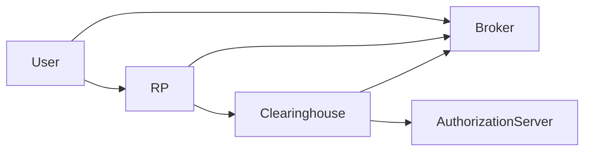
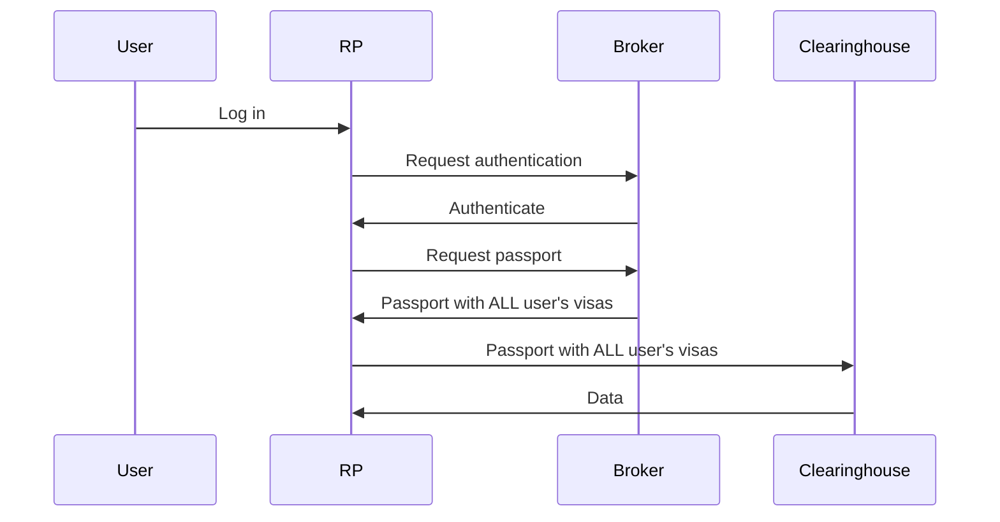
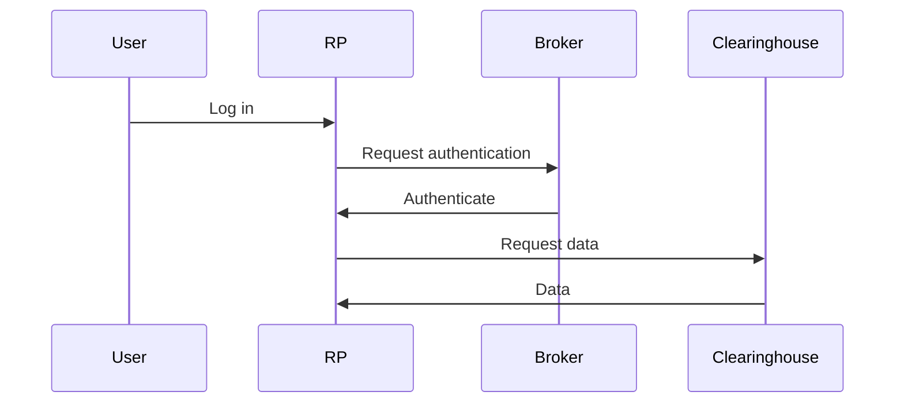

## Three GA4GH AAI Profiles

General Ecosystem



### Approach 1: All AuthZ through RP

```mermaid
sequenceDiagram
  User->>Broker
  User->>RP
  RP->>Broker
  RP->>Clearinghouse
  Clearinghouse->>AuthorizationServer
  Clearinghouse->>Broker
```


### Approach 2: Task-Specific AuthZ through RP


### Approach 3: No AuthZ through RP

## Three GA4GH AAI Profiles

General Ecosystem


### Approach 1: All AuthZ through RP




### Approach 2: Task-Specific AuthZ through RP


### Approach 3: No AuthZ through RP


